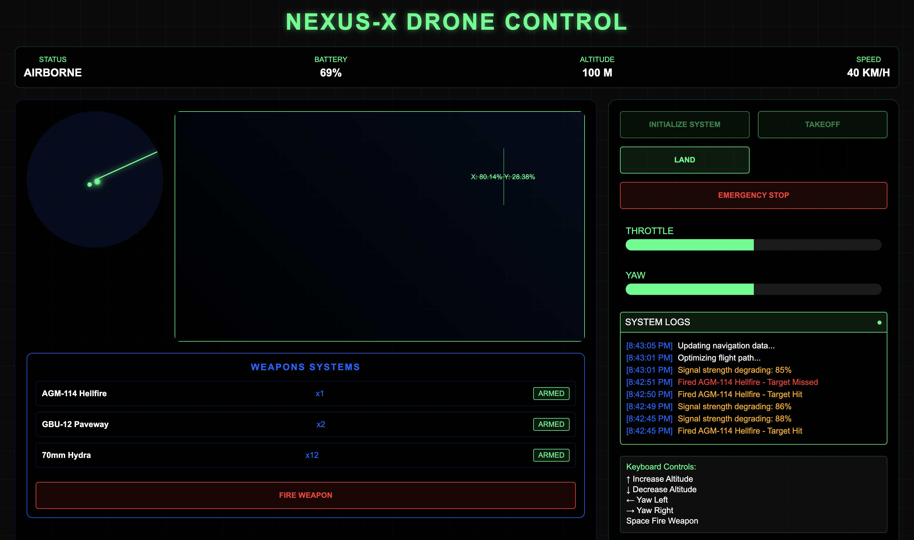

# NEXUS-X Drone Control System

A sophisticated web-based drone control interface featuring real-time telemetry, weapons systems management, and advanced flight controls.

## Features

### Flight Controls
- Real-time altitude and speed monitoring
- Dynamic throttle and yaw control
- Emergency stop functionality
- Automated takeoff and landing sequences

### Advanced Telemetry
- Live battery status monitoring
- GPS coordinate tracking
- Altitude and speed readings
- Environmental data (wind speed, temperature, heading)
- Signal strength monitoring

### Tactical Systems
- Integrated radar system with target tracking
- Multiple weapon systems management
  - AGM-114 Hellfire
  - GBU-12 Paveway
  - 70mm Hydra
- Advanced targeting system with hit probability calculation

### Interface Elements
- Modern, military-grade UI design
- Real-time system logs
- Interactive camera feed with crosshair tracking
- Status monitoring dashboard
- Keyboard control support

## Controls

### Keyboard Commands
- ↑ - Increase Altitude
- ↓ - Decrease Altitude
- ← - Yaw Left
- → - Yaw Right
- Space - Fire Weapon

## Technical Details

The system is built using:
- HTML5 for structure
- CSS3 for advanced styling and animations
- JavaScript for real-time functionality and system controls

## Safety Features

- Emergency stop protocol
- Low battery automatic landing
- Signal strength monitoring
- System status logging
- Weapon safety interlocks

## Preview

The interface features a dark, military-grade design with:
- Green and blue accent colors for optimal visibility
- Real-time data updates
- Animated radar display
- Interactive weapon systems
- Dynamic status indicators

## Note

This is a simulation interface and should only be used in appropriate training or demonstration environments.
